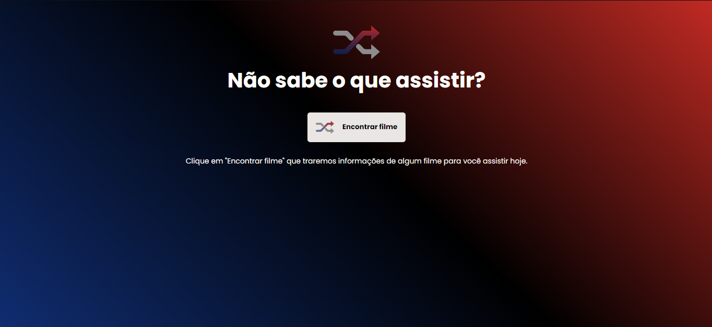

<h1 align="center">Rocketflix</h1>

<h2> :scroll: Descrição</h2>

  Nesse desafio eu tive quer reproduzir um layout estilo netflix, e o intuito desse site é puxar dados de uma API que mostrará filmes de diversas variedades para o usuário.

<h2> :computer: Build</h2>

  <li>Vite</li>
  <li>React</li>
  <li>API do TMDB (The Movie Database)</li>
  <li>Axios</li>

<h2> :framed_picture: Thumb</h2>

<a href="https://rocketflix-gules.vercel.app/">Accese aqui</a>
